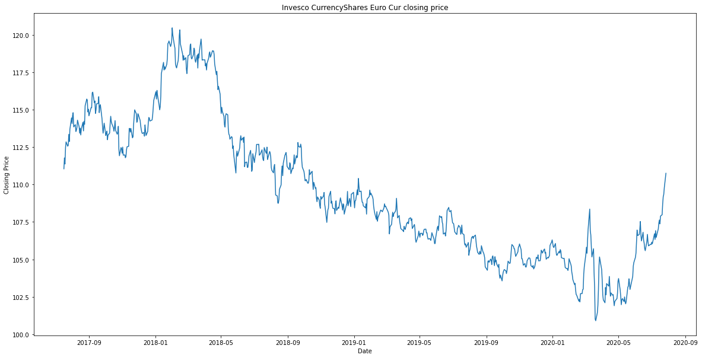

# Project_1

## Introduction
### Project Goal: 
The goal of our project was to identify and aggregate data to quantify the current market consensus on a selected security. By using the weekly Commitments of Trader (CoT) report from the CFTC we calculated the current net position in the futures/options traded on the selected security.

To demonstrate, below is the current net positioning on the Euro and the price performance of the Euro over the same time frame.

As you can see in the 'CFTC' chart the high point on the left of the chart (roughly April of 2018) was in fact the highest Net Long position in the EURO in the currency's history. In other words, according to our data market sentiment had never been as positive/bullish in 20 years! And as you can see with the price chart April 2018 was also the high point for the EURO, and preceded a 2 year decline in the EURO against the USD.

Before getting into our process, the data itself and our final product, I'd like to answer the question of why identifying market sentiment/consensus is valuable. Warren Buffett once said that it is wise for investors to be “fearful when others are greedy, and greedy when others are fearful.” Applying this wisdom to our data, in April 2018 it would've paid to recognize that the market sentiment on the EURO was at extremely extended levels. And it therefore would be prudent to reduce your long exposure to the Euro or perhaps even short the Euro.  

Our final summary sheet is below. We will of course go into more detail later in our presentation. However simply put we've identified a number of securities and calculated the Current Net positioning in the security. We then provide further context to the data by comparing the current net positioning in the security to the past by using a z-score. The z-score indicates how many standard deviations the current positioning is to the average and therefore whether the current positioning appears extended or not. By using a z-score we can compare multiple securities across multiple asset classes on an “apples to apples” basis. And get a quantified measure of the current market sentiment across the entire macro landscape.

## Data manipulation

The data manipulation can be found in the [CFTC Data.ipynb](CFTC data.ipynb) file

## Results

The data manipulation can be found in the [FinalDataAnalysis.ipynb](FinalDataAnalysis.ipynb) file
Visualizations can be found Visualization.ipynb(Visualization.ipynb) file
## Conclusion/recommendations

We feel that the z score can complement other strategies by reafirming a conclusion as well as assisting with market timing
