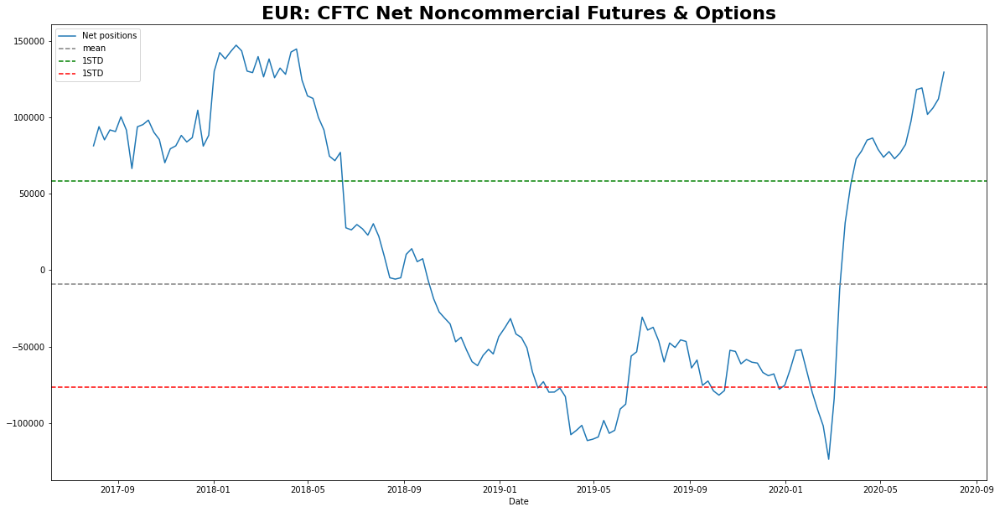
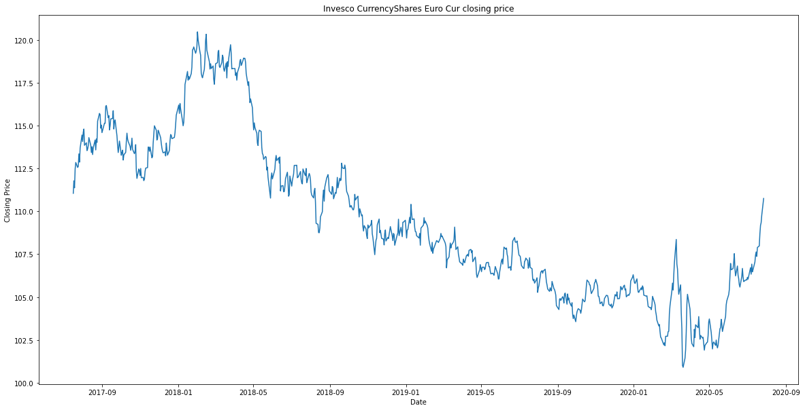
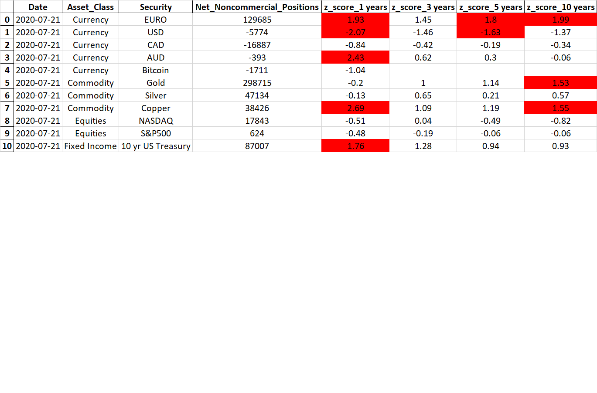

# Identifying Market Consensus using CFTC Weekly Data.
## Introduction
### Project Goal: 
The goal of our project was to identify and aggregate data to quantify the current market consensus on a selected security. By using the weekly Commitments of Trader (CoT) report from the CFTC we calculated the current net position in the futures/options traded on the selected security.

To demonstrate, below is the current net positioning on the Euro and the price performance of the Euro over the same time frame.

<<<<<<< Updated upstream

=======

>>>>>>> Stashed changes

As you can see in the 'CFTC' chart the high point on the left of the chart (roughly April of 2018) was in fact the highest Net Long position in the EURO in the currency's history. In other words, according to our data market sentiment had never been as positive/bullish in 20 years! And as you can see with the price chart April 2018 was also the high point for the EURO, and preceded a 2 year decline in the EURO against the USD.

## Research Questions

<<<<<<< Updated upstream
Our final summary sheet is below. We will of course go into more detail later in our presentation. However simply put we've identified a number of securities and calculated the Current Net positioning in the security. We then provide further context to our data by using a z-score. The z-score indicates how many standard deviations the current positioning is from the average and therefore whether the current positioning appears extended or not. By using a z-score we can also compare multiple securities across multiple asset classes on an “apples to apples” basis. And get a quantified measure of the current market sentiment across the entire macro landscape.
=======
**Can we use historic market data from Quandl to gauge current market sentiment in selected securities?**
>>>>>>> Stashed changes

Yes by pulling the weekly CFTC's Commitments of Traders (CoT) report we calculated the current net position in the futures/options traded on the selected security. 

**How is the market positioned in these securities relative to the historical past?** 

We used a z-score to provide context as to whether the current positioning appears extended or not based on historical average positioning.

**Does this measure have any predictive value for investors in terms of the future price of the selected security?** 

Please refer to our dashboard that shows a number of charts where the positioning crossed our overbought/oversold signal and a breakdown on the S&P500 futures/options and subsequent 30 day returns.

**How does this data inform a potential investment strategy?** 

We believe this is a great quantitative tool to gauge the current market consensus on a given security. By using z-scores we can identify whether this positioning is extreme or not and can compare securities across asset classes 'apples to apples'. 

To conclude we wouldn't use this data by itself to establish a position (long or short) in a security. However, this is great data to use to help with market timing and help determine appropriate position size for each security.

## Results - Summary Table

Below is our Summary Table:

<<<<<<< Updated upstream
## Conclusion/recommendations
=======
The data manipulation can be found in the [FinalDataAnalysis.ipynb](FinalDataAnalysis.ipynb) file
Visualizations can be found Visualization.ipynb(Visualization.ipynb) file

## Conclusion/recommendations

We feel that the z score can complement other strategies by reafirming a conclusion as well as assisting with market timing and position sizing.
>>>>>>> Stashed changes
